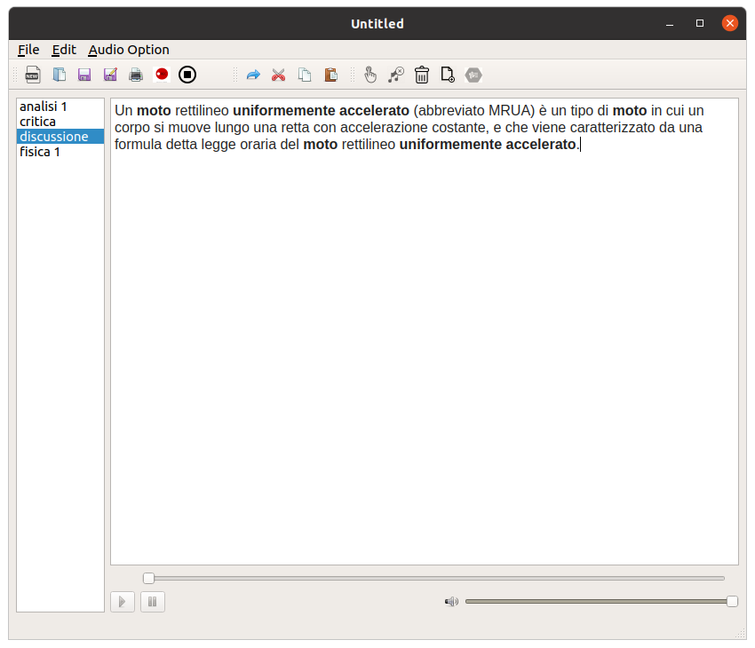

# Writernote

<table border="0px" ><tr><td width = 600px>


</td><td>

</td></tr></table>

## Features

<table>
<tr>
<td>

## Linux



</td>
</tr><tr><td>

</td></tr><tr>
</tr></table>

## Experimental Features:

- Compress video

## Installing
  - Linux: 
    ```bash
    sudo snap install writernote --edge
    ```
<iframe src="https://snapcraft.io/writernote/embedded?button=black" frameborder="0" width="100%" height="310px" style="border: 1px solid #CCC; border-radius: 2px;"></iframe>
  - Windows:
  Coming soon

  

## File format

The _.writer format is a compressed archive, in which a file `` index.json '' can be found, in which all the notebooks and all the audio are saved, whether they are recorded, or whether they are imported via the application.

When the file is opened, it is compressed and saved in a folder, called `` .temporaneo '', within the file location, when you then decide to save the file it is compressed and replaced with the original.

In case the program closes due to some problem, without compressing the `` .temporaneo '' folder, it can be recovered using the appropriate function within the application.

## Development

The application is entirely developed by Giacomo Groppi, and to become part of the development send an email to giamg01@gmail.com. To report a problem send an email to the same address [possible with the error log and with a photo].

See [GitHub:writernote](http://github.com/giacomogroppi/writernote) for current development.
